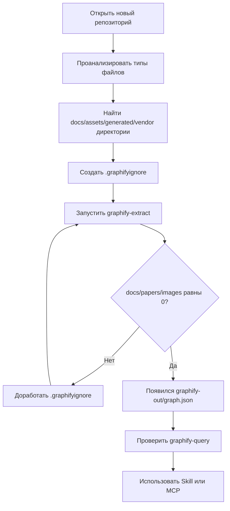

# Graphify: подключение нового репозитория на macOS

Пошаговый план для настройки Graphify в новом репозитории с учётом текущей macOS-конфигурации из `nix-config`.

Этот документ предполагает, что конфигурация уже применена командой вида:

```bash
sudo darwin-rebuild switch --flake ~/nix-config#m1-min
```

После этого в интерактивном `zsh` должны быть доступны алиасы:

```bash
graphify-extract
graphify-update
graphify-query
graphify-mcp
graphify-shell
```

А также flake apps напрямую:

```bash
nix run ~/nix-config#graphify-extract -- <project>
nix run ~/nix-config#graphify-update -- <project>
nix run ~/nix-config#graphify-query -- "question" --graph <project>/graphify-out/graph.json
nix run ~/nix-config#graphify-mcp -- <project>/graphify-out/graph.json
nix develop ~/nix-config#graphify
```

---

## 1. Цель настройки

Graphify строит граф кода:

- файлы
- классы
- функции
- методы
- импорты
- вызовы
- наследование
- связи между сущностями

Для вашей текущей интеграции целевой режим — **offline / code-only**:

- без LLM
- без API key
- без отправки данных наружу
- только локальное tree-sitter / AST-извлечение

Чтобы это работало, в индексируемый corpus не должны попадать:

- документация
- PDF / office-файлы
- картинки
- видео
- markdown-проза
- generated artifacts
- большие vendor-директории

Для этого в каждом новом проекте нужен `.graphifyignore`.

---

## 2. Общая схема подключения



---

## 3. Чек-лист перед началом

Перед настройкой нового репозитория проверьте:

- [ ] `nix-config` применён через `darwin-rebuild switch`
- [ ] открыт новый shell после применения конфига
- [ ] вы находитесь в корне нужного репозитория
- [ ] команда `graphify_flake_path` возвращает путь к `nix-config`
- [ ] alias `graphify-extract` существует
- [ ] в проекте нет уже старого сломанного `graphify-out/`, или вы готовы его пересоздать

Проверки:

```bash
graphify_flake_path
alias graphify-extract
alias graphify-query
```

Ожидаемо:

```text
/Users/test/nix-config
```

и alias вида:

```bash
graphify-extract='nix run "$(graphify_flake_path)"#graphify-extract -- .'
```

---

## 4. Шаг 1 — перейти в новый репозиторий

```bash
cd /path/to/new/repository
```

Убедитесь, что это корень проекта:

```bash
pwd
ls
```

Желательно, чтобы рядом были:

```text
.git/
flake.nix / package.json / pyproject.toml / Cargo.toml / go.mod / etc.
```

---

## 5. Шаг 2 — изучить структуру репозитория

### 5.1 Посмотреть верхнеуровневые директории

```bash
find . -maxdepth 2 -type d | sort
```

Ищите директории вроде:

- `src/`
- `app/`
- `lib/`
- `modules/`
- `packages/`
- `tests/`
- `docs/`
- `assets/`
- `images/`
- `screenshots/`
- `dist/`
- `build/`
- `target/`
- `node_modules/`
- `.venv/`
- `vendor/`
- `coverage/`

### 5.2 Посчитать расширения файлов

На macOS можно использовать:

```bash
find . -type f \
  -not -path './.git/*' \
  | sed -n 's|.*\.||p' \
  | sort \
  | uniq -c \
  | sort -nr
```

Пример результата:

```text
  180 ts
   65 md
   40 json
   25 png
   20 nix
   18 py
    5 yaml
```

### 5.3 Найти крупные файлы

```bash
find . -type f -size +1M -not -path './.git/*' -print
```

Большие файлы часто стоит исключить:

- картинки
- PDF
- видео
- дампы
- snapshots
- generated reports

### 5.4 Найти потенциальные docs/media

```bash
find . -type f \
  \( -name '*.md' -o -name '*.pdf' -o -name '*.png' -o -name '*.jpg' -o -name '*.jpeg' -o -name '*.svg' -o -name '*.docx' -o -name '*.xlsx' \) \
  -not -path './.git/*' \
  | sort
```

---

## 6. Шаг 3 — решить, что индексировать

Graphify в текущем режиме должен индексировать **код**, а не документацию.

Обычно оставляем:

- `.py`
- `.js`
- `.ts`
- `.tsx`
- `.jsx`
- `.sh`
- `.bash`
- `.rs`
- `.go`
- `.java`
- `.kt`
- `.cs`
- `.c`
- `.cpp`
- `.h`
- `.hpp`
- `.lua`
- `.zig`
- `.json` если это важная структура проекта

Обычно исключаем:

- `.md`
- `.txt`
- `.pdf`
- `.docx`
- `.xlsx`
- `.png`
- `.jpg`
- `.svg`
- `.yaml` / `.yml`, если это не код, а metadata/agent specs/config docs
- `docs/`
- `assets/`
- `screenshots/`
- `node_modules/`
- `.venv/`
- `dist/`
- `build/`
- `target/`
- `coverage/`
- `graphify-out/`

Важно: **не начинайте с `*` + `!*/` + `!*.ext`**. В текущей версии Graphify такой стиль может разигнорировать лишние документы.

---

## 7. Шаг 4 — создать `.graphifyignore`

### 7.1 Базовый шаблон

Создайте файл:

```bash
cat > .graphifyignore <<'EOF'
# Graphify offline profile: keep extraction code-only.

# Docs / prose
*.md
*.mdx
*.rst
*.adoc
*.asciidoc
*.org
*.txt
*.rtf
*.tex
*.html
*.htm
*.yaml
*.yml

# Papers / office / exported data
*.pdf
*.doc
*.docx
*.ppt
*.pptx
*.xls
*.xlsx
*.csv
*.tsv

# Images / media
*.png
*.jpg
*.jpeg
*.gif
*.webp
*.bmp
*.tif
*.tiff
*.svg
*.ico
*.mp3
*.wav
*.ogg
*.mp4
*.mov
*.avi
*.mkv

# Generated / local / vendor
.graphify-src/
.venv/
venv/
graphify-out/
result/
node_modules/
dist/
build/
.cache/
coverage/
target/

# Project docs / assets
/docs/
/assets/
/images/
/screenshots/
EOF
```

### 7.2 Адаптировать под проект

Добавьте директории, характерные для проекта:

```gitignore
/tmp/
/out/
/generated/
/vendor/
.fixtures/
.snapshots/
```

Если это монорепозиторий, добавьте generated-пути для каждого подпроекта.

---

## 8. Шаг 5 — первый запуск Graphify

Из корня проекта:

```bash
graphify-extract
```

Или без alias:

```bash
nix run ~/nix-config#graphify-extract -- .
```

Ожидаемый хороший результат:

```text
[graphify extract] scanning /path/to/project
[graphify extract] found N code, 0 docs, 0 papers, 0 images
[graphify extract] AST extraction on N code files...
[graphify extract] wrote /path/to/project/graphify-out/graph.json
```

---

## 9. Шаг 6 — если Graphify просит API key

Если вы видите:

```text
error: no LLM API key found
```

значит в corpus попали docs/papers/images.

Пример плохого summary:

```text
[graphify extract] found 846 code, 1011 docs, 2 papers, 65 images
```

### Что делать

1. Посмотреть, какие типы файлов есть:

```bash
find . -type f \
  -not -path './.git/*' \
  | sed -n 's|.*\.||p' \
  | sort \
  | uniq -c \
  | sort -nr
```

2. Добавить новые расширения в `.graphifyignore`.
3. Исключить директории с docs/assets/generated.
4. Перезапустить:

```bash
graphify-extract
```

Повторяйте, пока summary не станет:

```text
0 docs, 0 papers, 0 images
```

---

## 10. Шаг 7 — проверить, что граф создан

```bash
ls -lh graphify-out
```

Ожидаемо:

```text
graph.json
manifest.json
```

Можно быстро посмотреть статистику:

```bash
python3 - <<'PY'
import json
from pathlib import Path
from collections import Counter

g = json.loads(Path('graphify-out/graph.json').read_text())
nodes = g.get('nodes', [])
edges = g.get('edges', g.get('links', []))
print(f'nodes={len(nodes)} edges={len(edges)}')
print(Counter(Path(n.get('source_file', '')).suffix for n in nodes if n.get('source_file')).most_common())
PY
```

---

## 11. Шаг 8 — сделать первый запрос

```bash
graphify-query "explain the architecture"
```

Или явно:

```bash
nix run ~/nix-config#graphify-query -- "explain the architecture" --graph ./graphify-out/graph.json
```

Другие полезные запросы:

```bash
graphify-query "what depends on auth"
graphify-query "what calls login"
graphify-query "show the entry points"
graphify-query "what are the central modules"
```

---

## 12. Шаг 9 — обновлять граф после изменений

После правок кода:

```bash
graphify-update
```

Или:

```bash
nix run ~/nix-config#graphify-update -- .
```

Затем снова спрашивайте:

```bash
graphify-query "what changed around auth"
```

---

## 13. Использование со Skill

После применения системной конфигурации в Claude Code / совместимом агенте будет доступен Skill `graphify`.

Хорошие prompts:

```text
Use graphify to map this project and explain the architecture.
```

```text
Use graphify to show what depends on the auth module.
```

```text
Index this repository with graphify, then explain the main components.
```

Ожидаемый workflow агента:

1. распознаёт задачу как Graphify-задачу
2. находит путь к `nix-config` flake
3. запускает `graphify-extract` или `graphify-update`
4. читает `graphify-out/graph.json`
5. отвечает по графу
6. только если нужно — читает исходники напрямую

---

## 14. Использование с MCP

В вашей системе настроен `graphify` MCP server.

Он ищет граф так:

1. если задан `GRAPHIFY_GRAPH_PATH`, использует его
2. иначе ищет вверх от текущей директории:

```text
./graphify-out/graph.json
../graphify-out/graph.json
../../graphify-out/graph.json
```

### Ручная проверка MCP app

```bash
nix run ~/nix-config#graphify-mcp -- ./graphify-out/graph.json
```

Обычно этот сервер запускает агент/редактор, а не пользователь вручную.

---

## 15. Как это выглядит на вашей macOS системе

После `darwin-rebuild switch`:

### Shell aliases

```bash
alias graphify-extract
alias graphify-query
```

Ожидаемо:

```bash
graphify-extract='nix run "$(graphify_flake_path)"#graphify-extract -- .'
graphify-query='nix run "$(graphify_flake_path)"#graphify-query --'
```

### Поиск flake

```bash
graphify_flake_path
```

Ожидаемо:

```text
/Users/test/nix-config
```

### Построение графа

```bash
cd /path/to/project
graphify-extract
```

### Запрос

```bash
graphify-query "what depends on mcp"
```

---

## 16. Troubleshooting

### `graphify-extract: command not found`

Причина: shell не подхватил новые aliases.

Решение:

```bash
exec zsh
```

или используйте flake напрямую:

```bash
nix run ~/nix-config#graphify-extract -- .
```

### `graphify: could not locate nix-config flake`

Функция `graphify_flake_path` не нашла `flake.nix` в ожидаемых местах.

Проверьте:

```bash
ls ~/nix-config/flake.nix
```

Если репозиторий в другом месте, используйте explicit command:

```bash
nix run /absolute/path/to/nix-config#graphify-extract -- .
```

### `no LLM API key found`

В corpus попали docs/papers/images.

Решение: усилить `.graphifyignore`.

### `graphify-out/graph.json not found`

Сначала построить граф:

```bash
graphify-extract
```

Или указать путь явно:

```bash
export GRAPHIFY_GRAPH_PATH=/absolute/path/to/project/graphify-out/graph.json
```

### Граф построился, но нет нужных файлов

Проверьте `manifest.json`:

```bash
cat graphify-out/manifest.json
```

И проверьте, не исключили ли вы нужные расширения в `.graphifyignore`.

---

## 17. Финальный чек-лист подключения нового репозитория

### Анализ проекта

- [ ] я нахожусь в корне репозитория
- [ ] я посмотрел директории через `find . -maxdepth 2 -type d`
- [ ] я посчитал расширения файлов
- [ ] я нашёл docs/assets/generated/vendor директории

### `.graphifyignore`

- [ ] создан `.graphifyignore`
- [ ] исключены docs/prose форматы
- [ ] исключены office/paper форматы
- [ ] исключены images/media
- [ ] исключены generated/vendor/local директории
- [ ] исключён `graphify-out/`

### Первый запуск

- [ ] `graphify-extract` запускается
- [ ] summary показывает `0 docs, 0 papers, 0 images`
- [ ] появился `graphify-out/graph.json`
- [ ] появился `graphify-out/manifest.json`

### Проверка запросов

- [ ] `graphify-query "explain the architecture"` работает
- [ ] query возвращает узлы/связи
- [ ] после изменений работает `graphify-update`

### Интеграция с агентом

- [ ] Skill `graphify` доступен агенту
- [ ] MCP может найти `graphify-out/graph.json`
- [ ] агенту можно писать `Use graphify ...`

---

## 18. Минимальная команда для нового проекта

Если нужен короткий путь:

```bash
cd /path/to/project
cat > .graphifyignore <<'EOF'
*.md
*.txt
*.yaml
*.yml
*.pdf
*.docx
*.xlsx
*.png
*.jpg
*.jpeg
*.svg

graphify-out/
.venv/
venv/
node_modules/
dist/
build/
target/
coverage/
docs/
assets/
EOF

graphify-extract
graphify-query "explain the architecture"
```

Если summary показывает не `0 docs, 0 papers, 0 images`, вернитесь к `.graphifyignore` и добавьте недостающие исключения.
