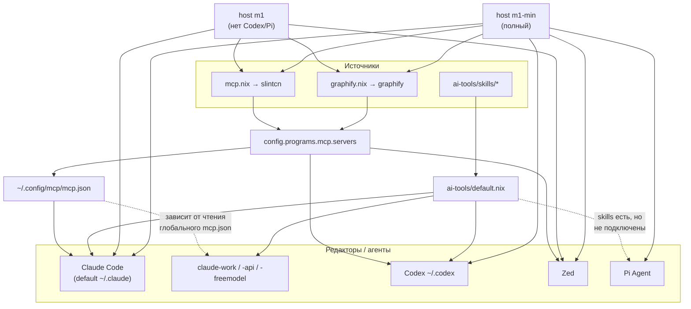
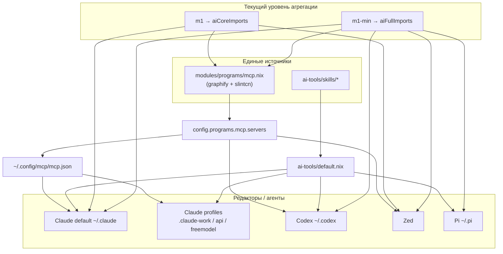

# План улучшения конфигурации MCP и Skills

> Цель: сделать подключение MCP-серверов и Skills **понятным, единообразным и
> визуально чётким** — один источник правды, один способ подключения на хост,
> минимум дублирования.

Дата: 2026-06-14 · Профиль-эталон: `darwinConfigurations.m1-min`

> Статус выполнения: фазы 1–4 выполнены; фаза 5 реализована частично безопасным
> способом (общие import-списки на хосте `m1`/`m1-min` вместо отдельного
> reusable-модуля `ai-core`/`ai-full`, который требовал бы дополнительной
> проработки порядка экспорта модулей через flake/import-tree).

---

## 1. Как всё устроено сейчас

### 1.1 Источники

| Что | Где определяется | Куда расходится |
|-----|------------------|-----------------|
| MCP-серверы | `modules/programs/mcp.nix` (`slintcn`, `graphify`) | общий HM-option `config.programs.mcp.servers` |
| Skills | `ai-tools/skills/*`, агрегация в `ai-tools/default.nix` | Claude Code, Codex, Pi |
| Общий MCP-файл | `programs.mcp` | `~/.config/mcp/mcp.json` |

### 1.2 Текущая схема подключения



---

## 2. Что мешает ясности (находки)

1. ~~**MCP-серверы определены в двух местах.**~~
   **Исправлено:** единый реестр MCP теперь находится в `modules/programs/mcp.nix`.

2. ~~**Extra-профили Claude (`.claude-work`, `.claude-api`, `.claude-freemodel`) не
   получают MCP напрямую.**~~
   **Исправлено:** в каждый extra-профиль теперь генерируется явный `.mcp.json`,
   ссылающийся на общий MCP-конфиг.

3. ~~**Сильное дублирование настроек в `claude-code.nix`.**~~
   **Исправлено:** общий блок вынесен в `commonClaudeSettings`.

4. ~~**Pi Coding Agent не получает Skills.**~~
   **Исправлено:** `~/.pi/skills` теперь генерируется из `aiTools.piCodingAgent.skills`,
   а shell aliases Pi запускают агент с `--skill $HOME/.pi/skills`.

5. **Хосты всё ещё задают AI-состав на уровне `modules/hosts/darwin/m1/default.nix`,**
   но дублирование уменьшено: используются общие `aiCoreImports` / `aiFullImports`.
   Отдельный reusable-модуль `ai-core`/`ai-full` пока отложен.

6. **Нет единого обзорного документа/диаграммы** — чтобы понять схему, нужно
   читать 6 `.nix` файлов.

---

## 3. Целевая схема



Принцип после выполненных фаз: **один реестр MCP → один общий option →
явные профили Claude → единые skills для Claude/Codex/Pi → уменьшенное
дублирование в host imports.** Отдельный reusable-модуль `ai-core` / `ai-full`
остаётся возможным follow-up шагом.

---

## 4. План по фазам

Порядок выстроен от безопасных рефакторов без изменения поведения к структурным,
а правки с неподтверждённым форматом (Pi, профили Claude) идут **только после
сбора доказательств**.

### Фаза 1 — Убрать дублирование настроек Claude (без изменения поведения)
- Вынести общий блок (`theme/hooks/verbose/attribution/statusLine/env/permissions`)
  в `let`-переменную `commonClaudeSettings` и переиспользовать её в основном
  профиле и в `mkExtraProfile`:

  ```nix
  let
    commonClaudeSettings = {
      theme = "dark";
      hooks = hooks;
      verbose = true;
      includeCoAuthoredBy = false;
      gitAttribution = false;
      attribution = { commit = ""; pr = ""; };
      statusLine = { /* ... */ };
      env = { /* ... */ };
      permissions = permissions;
    };
  in
  # основной профиль:
  settings = commonClaudeSettings;
  # extra-профиль:
  "${dir}/settings.json".text =
    builtins.toJSON (commonClaudeSettings // extraSettings);
  ```
- **Результат:** настройки меняются в одном месте; поведение идентично.

### Фаза 2 — Единый реестр MCP в `mcp.nix` (не плодить третий файл)
- Сделать `modules/programs/mcp.nix` **единственным** местом, где виден полный
  список MCP-серверов: перенести регистрацию `graphify` сюда.
- В `graphify.nix` оставить только flake apps / package / devShell / zsh-aliases;
  если graphify-wrapper большой — вынести его как helper-функцию, но итоговый
  `programs.mcp.servers = { ... }` держать в `mcp.nix`.
- Один импорт `mcp-servers-nix` и один `programs.mcp.enable`.
- **Целевое разделение:**

  ```text
  mcp.nix       = единственный реестр MCP-серверов (graphify, slintcn)
  graphify.nix  = Graphify flake outputs / package / aliases
  ```
- **Инвариант:** `programs.mcp.servers == ["graphify", "slintcn"]` — не меняется.

### Фаза 3 — MCP в extra-профилях Claude: сначала evidence
- **Сначала проверить** реальное поведение Claude Code с
  `CLAUDE_CONFIG_DIR=$HOME/.claude-work`: читается ли при этом глобальный
  `~/.config/mcp/mcp.json`, и в каком файле/ключе он вообще ждёт MCP
  (`mcp.json`, `.mcp.json`, часть `settings.json` или глобальный путь).
- Если глобальный конфиг читается → явно задокументировать и добавить
  eval/test-проверку. Если нет → генерировать MCP-конфиг в **ожидаемом Claude
  Code пути** для каждого профиля. Не писать `.claude-*/.mcp.json` вслепую.
- **Результат:** MCP в `claude-work/api/freemodel` работает гарантированно и
  по подтверждённой схеме.

### Фаза 4 — Pi: сначала подтвердить формат, потом подключать
- **Сначала выяснить** формат конфигурации Pi: где он ищет Skills, читает ли
  каталог/symlink, поддерживает ли MCP, и в каком JSON-ключе это задаётся.
- Если Pi поддерживает skills-директорию → подключить
  `aiTools.piCodingAgent.skills` (по аналогии с `.codex/skills`).
- Если нет → зафиксировать это в документации и **не имитировать** поддержку
  пустым `home.file`, который Pi не читает.
- **Результат:** Skills единообразны там, где это реально поддерживается.

### Фаза 5 — Двухуровневый стек: `ai-core` и `ai-full`
- Не делать один жёсткий `ai-stack`. Вместо этого:

  ```text
  ai-core = mcp + graphify + claude-code + zed
  ai-full = ai-core + codex + pi-coding-agent
  ```
- Хосты подключают нужный уровень одной строкой:

  ```nix
  m1     imports ai-core   # осознанно без Codex/Pi
  m1-min imports ai-full
  ```
- **Результат:** хосты не расходятся, но состав инструментов остаётся явным
  выбором, а не навязанным «всё или ничего».

### Фаза 6 — Обзорная документация
- Этот файл + диаграмма как единая точка входа.
- Таблица «какой редактор → откуда берёт MCP и Skills» (раздел 5).

---

## 5. Карта «редактор → источник» (целевая)

| Редактор | MCP-источник | Skills-источник | Статус сейчас |
|----------|--------------|-----------------|----------------|
| Claude Code (default) | `mcp.json` + `enableMcpIntegration` | `ai-tools/skills` | ✅ |
| Claude work/api/freemodel | `.mcp.json` → общий `mcp.json` | `ai-tools/skills` | ✅ |
| Codex | `programs.mcp.servers` | `ai-tools/skills` | ✅ |
| Zed | `programs.mcp.servers` | — | ✅ |
| Pi Agent | CLI alias `--skill $HOME/.pi/skills` | `ai-tools/skills` | ✅ Skills; MCP не подключён |

---

## 6. Порядок выполнения и проверка

Фазы уже упорядочены под безопасное выполнение: **1 → 2 → 3 → 4 → 5 → 6**
(dedup Claude → реестр MCP → evidence по профилям Claude → research Pi →
`ai-core`/`ai-full` → документация). Фазы 3 и 4 не начинать без подтверждения
формата.

После каждой фазы — базовые проверки:

```sh
nix flake show --accept-flake-config
nix eval --accept-flake-config --json \
  .#darwinConfigurations.m1-min.config.home-manager.users.test.programs.mcp.servers \
  --apply builtins.attrNames
nix build --accept-flake-config \
  .#darwinConfigurations.m1-min.config.home-manager.users.test.home.activationPackage --no-link
```

Плюс проверка состава сгенерированных файлов и их содержимого:

```sh
# какие файлы вообще генерируются профилю
nix eval --accept-flake-config --json \
  '.#darwinConfigurations.m1-min.config.home-manager.users.test.home.file' \
  --apply builtins.attrNames

# содержимое ключевых артефактов (путь generation из nix build выше)
cat .../home-files/.config/mcp/mcp.json
cat .../home-files/.config/zed/settings.json
cat .../home-files/.codex/config.toml
```

### Инварианты приёмки

```text
programs.mcp.servers              == ["graphify", "slintcn"]
Zed   context_servers            содержит graphify + slintcn
Codex mcp_servers                содержит graphify + slintcn
Claude default profile           имеет skills
Claude extra profiles            имеют skills  (MCP — по подтверждённой схеме, фаза 3)
Pi                               НЕ заявлен как поддерживающий skills/mcp,
                                 пока формат не подтверждён (фаза 4)
```
